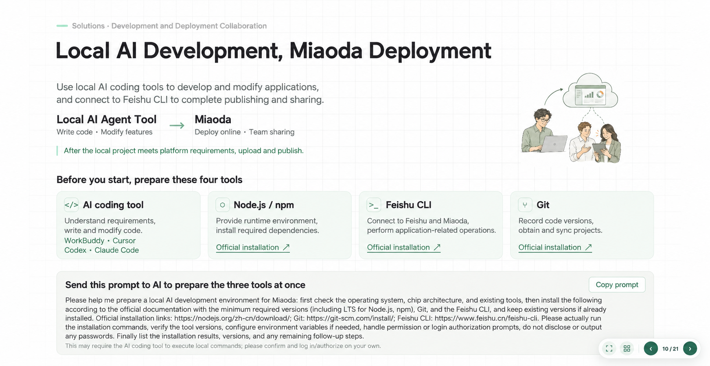
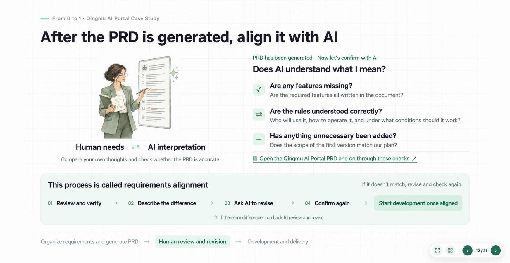
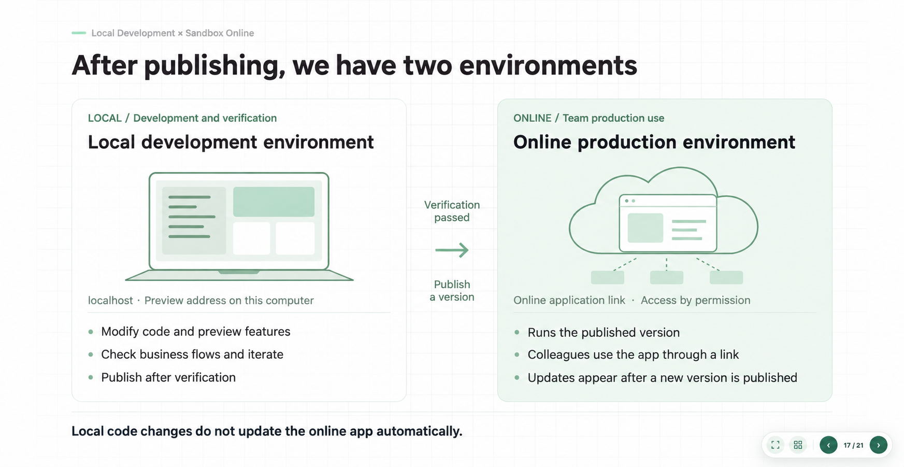
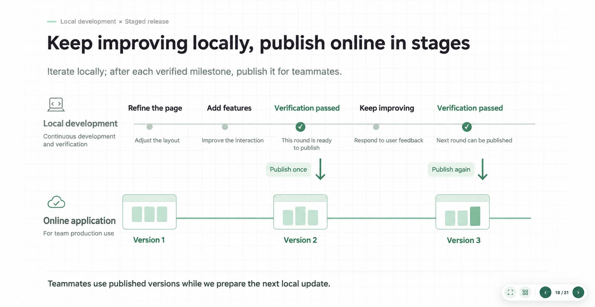

# WBY HTML PPT

[中文](README.zh-CN.md) | **English**

> A Codex Skill for turning a speaking goal into an interactive, shareable HTML presentation.

WBY HTML PPT helps an AI choose the right copy, visual expression, and page composition for each part of a talk. It combines scene-specific illustrations, real screenshots, code-drawn diagrams, and consistent presentation controls—then packages the result as a standalone HTML file.



## What you get

| Start with | Deliver |
|---|---|
| A speaking goal, audience, existing deck, or raw material | Editable HTML slide sources and one shareable standalone HTML file |
| A business scenario or teaching point | Copy, illustrations, screenshots, diagrams, and composition chosen for that scenario |
| Iteration feedback on individual slides | Revised pages that preserve the approved parts of the deck |

Every delivery includes keyboard navigation, fullscreen, thumbnail overview, image enlargement, page boundaries, and working external links. Motion is supported when it clarifies a relationship or sequence.

## Quick start

Clone the Skill into Codex’s default local Skill directory:

```sh
git clone https://github.com/SuperWBY/wby-html-ppt.git ~/.codex/skills/wby-html-ppt
```

Open a new Codex session and use this prompt:

```text
Use $wby-html-ppt to make a presentation from my materials.
Choose copy, illustrations, and composition based on each slide's speaking goal.
Keep the deck visually coherent, include the standard presentation controls,
and deliver editable source files plus a shareable standalone HTML file.
```

To revise an existing deck:

```text
Use $wby-html-ppt to revise slide 6 of this deck and preserve the other approved slides.
```

## How it works

```text
Speaking goal → content relationships → visual direction → composition and assets
→ implementation → slide-by-slide feedback → standalone delivery
```

- **Match the visual form to the message.** A character illustration can show uncertainty or realization; tool diagrams can explain a system; real screenshots can establish evidence.
- **Keep controls consistent.** The visual system changes with the deck, while navigation and delivery behavior stay reliable.
- **Build from approved work.** Revisions continue the current deck instead of recreating unrelated pages.

## Built-in presentation controls

| Input | Action |
|---|---|
| ← / → | Previous / next slide |
| Fullscreen button / F | Toggle fullscreen, subject to browser support and permissions |
| Overview button / O | View thumbnails and click to jump |
| Esc | Close overlays; the browser handles exiting fullscreen |
| Click a marked screenshot | Enlarge the image |
| Document / application link | Open the actual external resource |

The player supports lightweight transitions and optional CSS/SVG content animation. It respects `prefers-reduced-motion`, does not auto-advance by default, and does not intercept typing in editable fields.

## Examples

The English README uses localized versions of the original showcase deck. The [Chinese README](README.zh-CN.md) retains the Chinese images. These are examples of visual approaches, not layouts that every deck must copy.

<p align="center">
  
  
</p>

<details>
<summary>See more examples</summary>

<br />



</details>

## Included tools

| Tool | Purpose |
|---|---|
| `scripts/studio.py` | Initialize decks, add, move, remove, inspect, check, build, and preview slides |
| `scripts/build.py` | Embed local assets and build one standalone HTML presentation |
| `assets/player.html` | Reusable presentation controls, independent of slide visual design |
| `references/` | Bilingual authoring, copywriting, visual-direction, interaction, and delivery guidance |

For commands and workflow details, see the [built-in CLI guide](references/slide-authoring.md).

## Standalone HTML delivery

The builder requires Python 3.9+ and no third-party Python packages. Maintain an ordered manifest:

```json
{"title":"My presentation","slides":["slides/intro.html","slides/example.html"]}
```

Then build the final file:

```sh
python3 scripts/build.py /path/to/project \
  --manifest /path/to/project/deck.json \
  --output /path/to/project/dist/presentation.html
```

It embeds supported local stylesheets, classic scripts, images, and CSS `url()` assets. It preserves external hyperlinks, which still require network access and permission.

## Scope and limitations

- The output is HTML, not an automatically editable PowerPoint `.pptx` file.
- Convert ES modules, dynamic `fetch`, CSS `@import`, `srcset`, and remote embedded resources to static local assets before building.
- A recipient should download the final HTML and open it in a modern desktop browser. Chat previews may disable scripts.
- Verify layout, controls, and external links in a browser before delivery.

## Contributing

Contributions are welcome for reusable interactions, authoring improvements, documentation, verification coverage, and clearly labeled example decks. Please open an issue first for a substantial change, then include the relevant validation in your pull request.

## Repository map

- [SKILL.md](SKILL.md): English agent instructions; [中文版](SKILL.zh-CN.md).
- `references/`: visual decisions, interactions, and delivery guidance in both languages.
- `assets/player.html`: reusable controls shell.
- `scripts/`: page management, checks, preview, and standalone packaging.
- `docs/images/`: Chinese and English showcase screenshots.

## License

No license has been selected yet. Until a license is added, do not assume permission to reuse, modify, or redistribute this repository’s contents.
