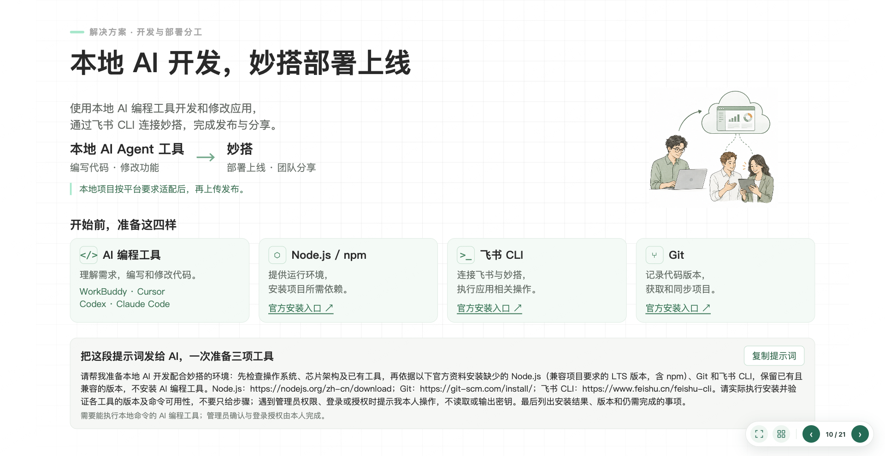
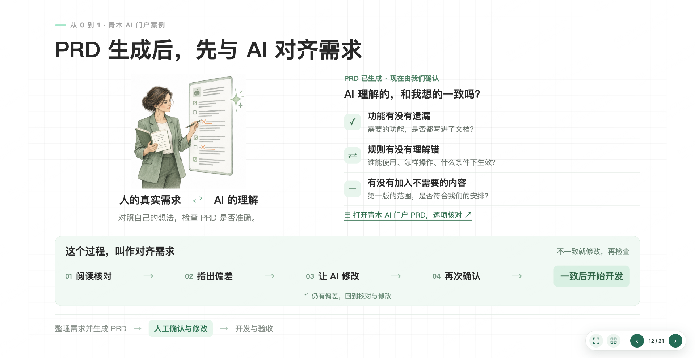
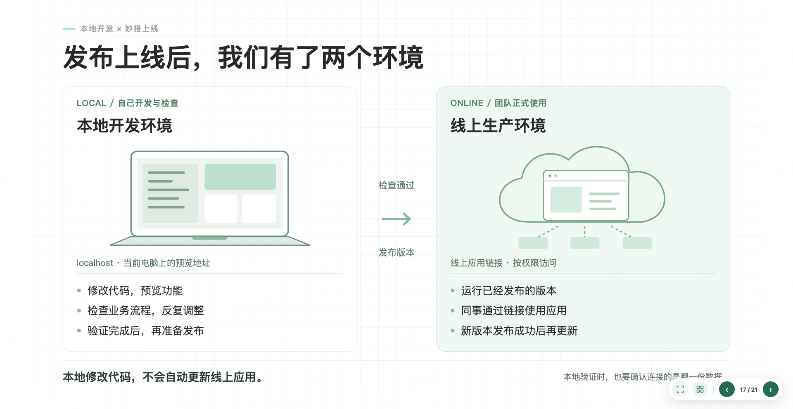
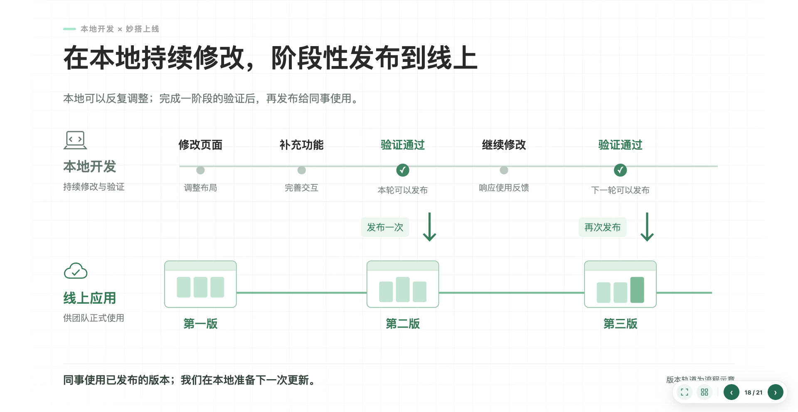

# WBY HTML PPT

**中文** | [English](README.md)

根据讲解目标制作 HTML 演示文稿的 AI Skill：把内容判断、文案、场景插画、真实截图、代码图形和演示交互串成一套工作方法。

**表达方式随内容变化，演示交互保持一致。** 这里展示的绿色与水彩人物属于案例风格，不是所有课件必须使用的模板。

## 制作方法

讲解目标 → 内容关系 → 视觉方向 → 构图与素材 → 页面实现 → 逐页反馈 → 成品交付。

- 人物插画表现业务困惑、讨论、领悟等场景，表情和动作需要与内容一致。
- 工具插图表现电脑、云端、代码、文档与应用之间的关系。
- HTML/CSS/SVG 表现流程、对照、卡片、图标、气泡和版本时间线。
- 真实截图用于实际对话与应用证据；教学示意必须标明身份。
- 章节过渡用少量文字和合适的主题视觉，给讲解留出停顿。
- 先延续已确认的课件，再针对反馈修改，不为每个请求重做整套。

## 固定交互与动画

| 操作 | 功能 |
|---|---|
| ← / → | 上一页 / 下一页 |
| 全屏按钮 / F | 切换全屏（受浏览器支持与权限影响） |
| 总览按钮 / O | 总览全部页面，点击缩略图跳转 |
| Esc | 关闭浮层；全屏退出由浏览器处理 |
| 点击标记的截图 | 放大查看 |
| 文档 / 应用链接 | 打开真实外部资源 |

包含页码、首末页边界处理、输入焦点保护和 iframe 内快捷键支持。可选提示词复制按钮。播放器支持轻量过渡，内容可按需要添加 CSS/SVG 动画；尊重系统“减少动态效果”设置，不默认自动翻页。

## 安装与使用

需要支持本地 Skill 的 AI 工具。以下为 Codex 默认目录的安装示例；目标目录已存在时，先检查现有版本。

```sh
git clone https://github.com/SuperWBY/wby-html-ppt.git ~/.codex/skills/wby-html-ppt
```

重新打开会话后调用：

```text
使用 $wby-html-ppt，根据我的材料制作课件。
按每页的讲解目标决定文案、插画和构图，保持整套风格一致。
加入固定演示交互，交付源项目和可以转发的单文件 HTML。
```

也可以说：“使用 $wby-html-ppt 修改现有课件第 6 页，保留其他已确认页面。”

Skill 能独立提供制作判断与打包工具。oil-ppt、oil-tone 是可选协同能力，使用时需在环境中可用；需要 AI 生图时还需要相应的图片生成工具。仓库不附带模型服务、API 密钥或这些外部 Skill。

## 打包

打包脚本使用 Python 3.9+，无需第三方 Python 依赖。先制作标准静态 HTML 单页，再维护唯一页面清单：

```json
{"title":"我的演示","slides":["slides/intro.html","slides/example.html"]}
```

```sh
python3 scripts/build.py /path/to/project   --manifest /path/to/project/deck.json   --output /path/to/project/dist/presentation.html
```

支持本地样式表、普通脚本、图片，以及 style 标签和样式表中的 CSS url() 资源。资源限于项目目录，嵌入并去重。播放器默认 16:9，可修改。源页面决定课件语言；随附播放器界面当前为中文。

ES modules、动态 fetch、CSS @import、srcset、远程嵌入资源需要先转成静态资源；此脚本不是通用网页归档器。外部文档链接仍需要网络和访问权限。接收者下载 HTML 后用现代桌面浏览器打开，聊天窗口预览不一定执行脚本。交付前需实测布局与交互，不能仅凭打包成功判断完成。

## 案例展示

以下为作者提供的中文课件截图，展示不同表达方式；不是待套用的固定版式。这里只发布展示截图，不包含完整业务课件、内部文档或数据。

### 工具清单与场景插画


### 人物插画、核对清单与流程


### 章节过渡与情绪表达


### 工具图形与左右对照


### 双轨时间线与版本变化


## 仓库内容

- [SKILL.zh-CN.md](SKILL.zh-CN.md)：中文执行指南；[English](SKILL.md)。
- `references/`：视觉选择、交互和交付细则，中英文对应。
- `assets/player.html`：可复用的交互外壳，页面视觉由项目自行设计。
- `scripts/build.py`：单文件打包工具。
- `docs/images/`：这次课件的展示截图。

这里交付的是 HTML 演示文稿，不直接生成可编辑的 PowerPoint `.pptx`。如需 PPTX，应另行使用导出流程并检查可编辑性。
